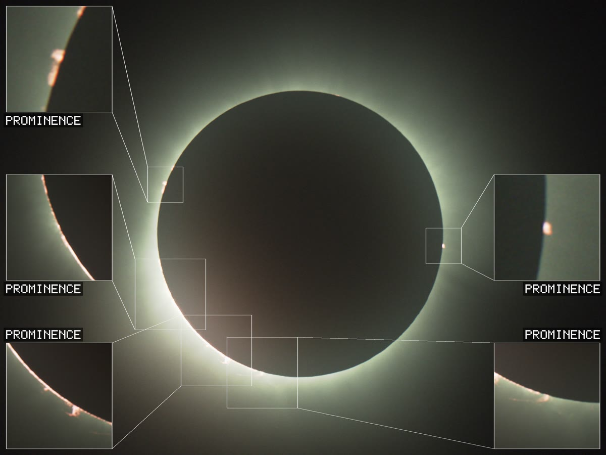
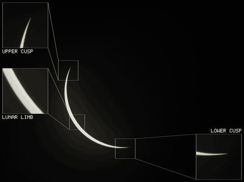

# solar-eclipse-timelapse



Turns a total solar eclipse shoot — SER video from a planetary camera, or a
folder of stills from a DSLR — into a tracked, annotated timelapse. It finds the
exposure changes you made by hand, holds the Sun still while the mount drifts,
stacks and drizzles what it can, and places labelled zoom panels on the features
that are actually there: prominences, the cusps, Baily's beads, the lunar limb,
a sunspot.

One required argument: the folder your captures are in.

```powershell
python -m ecl.run "D:\eclipse\data"
```

Everything else is surveyed from the data and the machine on startup, written to
an editable config, and reused from then on.

**The finished video is on the
[v0.1.0 release](https://github.com/dmead/solar-eclipse-timelapse/releases/tag/v0.1.0)**
— 2228 frames, 74 s at 30 fps, all 22 captures, in full resolution (108 MB), a
1080-wide cut and a 2 MB preview. That frame above is one of its frames; nothing
in it was placed by hand.

`timelapse.gif` below is one of the pipeline's own outputs, not a still cut by
hand: nine seconds assembled from four segments it picked out of the run — the
crescent at its thinnest, the filter coming off, second contact, and totality.
Each chapter is located from what the earlier passes marked, so data that is
totality only gets three chapters over the same budget and nothing is
special-cased.



## Holding the Sun still

The same frames, through the same gains, cropped two ways. On the left the
window never moves; on the right it follows the fitted disc track. Nothing else
differs — the two configs are one file with one field changed, so every pair of
sequence numbers is the same exposure at the same stack depth.


Over the 45 minutes the Sun travels **523 × 277 px in a 1200 × 900 window** —
44% of the frame width, 1.8 solar radii — and at the extremes the disc runs 105
px past the edge. Almost none of that is the mount losing the Sun: within any
one capture the drift is 20–49 px. It is the boundaries, where the mount was
nudged by hand between captures, and three of those move the Sun 544, 387 and
262 px in a single frame.

This is also why the tracking is a fitted disc track rather than frame-to-frame
correlation. Correlation locks onto the brightest thing in the frame, which
during the partial phases is the crescent — and a crescent's centroid is not the
centre of the disc it was cut from, so it slides around the limb as the Moon
advances. `docs/NOTES.md` has the measurements.

---

Written for one shoot — the 2024-04-08 totality from Cleveland, an ASI585MC on a
70 mm refractor — and then generalised. Every geometric constant is a fraction
of the solar radius the survey measures, so the same config works on an 80 px
disc and a 900 px one. [`docs/NOTES.md`](docs/NOTES.md) is the account of that
shoot and what the data turned out to need; [`docs/STATE.md`](docs/STATE.md) is
the running engineering log.

---

## Try it without any data

A fixture ships with the pipeline, so you can check an install end to end in
about a minute rather than by waiting for an eclipse:

```powershell
python tools/make_synthetic.py D:\eclipse-demo\data
python -m ecl.run D:\eclipse-demo\data
```

That writes three synthetic captures — partial phases, second contact, a
three-step exposure ladder through totality, third contact, partial phases — and
runs every pass over them, ending at an mp4 in `D:\eclipse-demo\out\final`.
Add `--format png` or `--format xisf` to exercise the other readers.

---

## 1. Install

You need Python 3.11 or newer and ffmpeg. Nothing else is assumed.

```powershell
winget install --id Python.Python.3.12 -e
winget install --id Gyan.FFmpeg -e
```

Close and reopen PowerShell so both land on `PATH`, then check:

```powershell
python --version
ffmpeg -version
```

Get the code and build a virtual environment beside it:

```powershell
cd D:\projects
git clone https://github.com/dmead/solar-eclipse-timelapse.git
cd solar-eclipse-timelapse

python -m venv .venv
.\.venv\Scripts\Activate.ps1
python -m pip install --upgrade pip
python -m pip install -e .
```

A plain `pip install .` works too, and so does `uv sync` if you use uv — the
lock file is committed. `-e` matters only if you intend to edit the code.

If `Activate.ps1` is blocked, PowerShell is refusing to run local scripts. Allow
it for your account only:

```powershell
Set-ExecutionPolicy -Scope CurrentUser RemoteSigned
```

That is the whole install. Every dependency comes from PyPI — there is no
sibling repository to clone and no local path to configure. The numeric spine
(FFT registration, sub-pixel warp, the drizzle stacker, SER and XISF I/O) is
vendored in `ecl/vendor/`; see that package's docstring for its provenance.

The install also puts an `eclipse-timelapse` command on your PATH, which is
`python -m ecl.run` under a shorter name. This README uses the module form
throughout, because it works whether or not you activated the environment.

**Optional readers**, only if you have that kind of data:

```powershell
python -m pip install ".[raw]"     # CR2/CR3/NEF/ARW/DNG/RAF/ORF/RW2
python -m pip install ".[fits]"    # FITS
```

The pipeline tells you which one you need if it meets a file it cannot open, and
it does so on the first frame rather than four hundred frames in.

---

## 2. Lay out your data

Three layouts are accepted, because all three are what people actually have.
Pick whichever matches; you do not configure this.

```
data\                     data\                      data\
  13_44_19.ser              13_44\                     IMG_0001.CR2
  13_52_58.ser                IMG_0001.CR2             IMG_0002.CR2
  14_13_00.ser                IMG_0002.CR2             IMG_0003.CR2
                            14_13\                     ...
one SER per capture           IMG_0100.CR2           one flat run of images
                          one folder per capture
```

**Formats.** SER, plus one-exposure-per-file in TIFF, XISF, FITS, PNG, JPEG, or
camera RAW (CR2/CR3/NEF/ARW/DNG/RAF/ORF/RW2). TIFF is read through `tifffile`
and XISF through the vendored reader, both at full depth; RAW needs `[raw]` and
FITS needs `[fits]`.

**Shoot at more than 8 bits if you can.** A corona needs a gain of several
hundred before it is visible at all, and at 8 bits the quantisation step
multiplied by that gain is salt-and-pepper across the whole frame. The pipeline
will happily process 8-bit input and the result will look noisy for a reason
that is not the pipeline's.

A **capture** is one uninterrupted run at one camera setting. Splitting your
shoot into captures the way you actually shot it matters more than the format:
the exposure normalisation, the gain chaining and the drift track are all
per-capture, and one giant folder spanning a filter change will be normalised as
though the filter never came off.

Files are ordered **naturally**, so `IMG_9` sorts before `IMG_10`. A plain
alphabetical sort gets that wrong once every power of ten and produces a
scrambled sequence rather than an error.

---

## 3. Run

```powershell
cd D:\projects\solar-eclipse-timelapse
.\.venv\Scripts\Activate.ps1

python -m ecl.run "D:\eclipse\data" --dry-run     # survey and plan, run nothing
python -m ecl.run "D:\eclipse\data"               # the whole thing
```

The passes, in the order they run and with what each leaves behind:

| pass | writes | what it decides |
|---|---|---|
| `survey` | `survey.json` | sensor, disc radius, drizzle, worker count |
| `segment` | `segments.json` | where your exposure changed, to the frame |
| `beads` | `diag/beads.json` | the Baily's bead window either side of contact |
| `select` | `configs/timelapse.json` | which frames make the video, and their gains |
| `centres` | `diag/centres.json` | a disc centre on every frame |
| `track` | `diag/corona_track.json` | pointing through totality |
| `smooth` | (the config) | the drift model, and which fits to distrust |
| `insets` | (the config) | what each zoom panel follows |
| `render` | `frames/*.png` | the frames |
| `encode` | `final/*.mp4`, `final/timelapse.gif` | three cuts and the preview |

Outputs go to `D:\eclipse\out` by default — beside the data, not inside it, so a
read-only or network data folder works. Override with `--out` and `--frames`.

Running a single stage by hand takes its defaults from the environment rather
than from any particular drive:

```powershell
$env:ECLIPSE_DATA = "D:\eclipse\data"     # the captures
$env:ECLIPSE_OUT  = "D:\eclipse\out"      # survey.json, configs\, diag\

python -m ecl.progress            # no arguments needed
python -m ecl.beadwindow
```

`ecl.run` never reads those — it works both out from the data directory you give
it — so they only matter for running a stage on its own.


Watch a long render from another window:

```powershell
python -m ecl.progress --frames "D:\eclipse\out\frames" --watch
```

Re-run part of it:

```powershell
python -m ecl.run "D:\eclipse\data" --from insets   # insets onward
python -m ecl.run "D:\eclipse\data" --only render,encode
```

**`--from` re-runs that pass and everything after it, deliberately.** Each pass
rewrites `configs\timelapse.json` in place, adding what it measured to what the
last one left, so running one pass against a config a later pass already touched
is the standard way to corrupt a run. It has happened twice here.

If a render is interrupted, resume rather than restart:

```powershell
python -m ecl.tl_render --config "D:\eclipse\out\configs\timelapse.json" `
  --data-dir "D:\eclipse\data" --out-dir "D:\eclipse\out\frames" --resume
```

---

## 4. What the survey decides for you

On startup `ecl.survey` reads a handful of frames from each capture and prints
what it found:

```
surveying 22 capture(s) in Z:/solar-eclipse/Sun
  14_13_00.ser 3840x2160 CFA n=1391 23.13fps  r=291.8
  -> 29038 frames, plane 1920x1080, disc radius 291.8 px
  -> drizzle x2, 24 workers (24 cores, 219 by memory at 0.50 GB each, 182 GB free)
```

| surveyed | used for |
|---|---|
| format, bit depth, CFA or RGB | which reader, and whether planes are half-size |
| sensor size | memory per worker |
| **solar radius in pixels** | every geometric constant in the pipeline |
| frame count and cadence | dwell lengths, drizzle group size |
| cores and free memory | worker count |

**The disc radius is the important one.** Every box size, separation and
tolerance in this pipeline was originally a pixel count measured on one camera,
where the Sun happened to be 279 px across. They are now stored as fractions of
the solar radius, so the same config gives sensible pixel values whether your
disc is 80 px or 900:

| | r = 292 (this data) | r = 900 (full frame) | r = 80 (short lens) |
|---|---|---|---|
| prominence separation | 94 px | 291 px | 26 px |
| cusp box half-width | 42 px | 129 px | 11 px |
| alignment shift bound | 4.2 px | 12.9 px | 1.1 px |
| smallest bead | 44 px² | 416 px² | 3 px² |

**Memory.** A worker holds several copies of the drizzled frame, so cost scales
with sensor area and the square of the drizzle factor: about 0.5 GB per worker
here, about 4.6 GB for a full-frame sensor at drizzle 2. The survey divides your
free memory by that and takes the smaller of it and your physical core count.

**Drizzle** is chosen from how well sampled your disc already is. Drizzling
exists to recover detail lost to coarse sampling; if your disc is already 900 px
across, upsampling only multiplies the pixel count, so the survey drops it to 1.

---

## 5. Tuning

First run writes `out\eclipse.toml` with every setting in it and a comment on
each. **It is never overwritten** — re-running reads your edits.

```toml
[dwell]
# screen seconds held on Baily's beads
beads_s = 10.0
# screen seconds on the corona proper
corona_s = 10.0

[geometry]
# 0 = use the radius measured by the survey
radius_plane_px = 0.0

[render]
# 0 = auto (physical cores, capped by free memory)
workers = 0
```

Conventions: keys ending **`_r`** are fractions of the solar radius, **`_r2`** of
its square, **`_s`** are seconds, and everything else is dimensionless. Delete
any key to fall back to the built-in default.

Things worth changing first:

| setting | when |
|---|---|
| `dwell.*_s` | the video lingers too long or not long enough somewhere |
| `render.workers` | you want the machine back while it runs |
| `geometry.radius_plane_px` | the survey measured the disc wrong |
| `geometry.output_half_r` | you want more or less corona in frame |
| `panels.zoom` | inset panels too tight or too loose |
| `panels.min_clear_r` | panels crowd the disc, or you want the top/bottom slots back |
| `select.flatten_max` | brightness still steps inside a capture, or is over-corrected |
| `render.group_level_tol` | the renderer reports dropping a lot of frames from their groups |
| `panels.size_frac` | panels too large or too small for the output frame |
| `panels.max_panels` | you want fewer things labelled at once |
| `centres.r_search_*_r` | the one global radius acquisition looked in the wrong range |
| `gif.seconds`, `gif.width` | the animated preview is too long, too short, or too big a file |

---

## 6. When it goes wrong

**"no captures found"** — the folder has no `.ser` and no images the loader
recognises. Check you pointed at the folder *containing* the captures.

**"no frame in this data has a measurable solar disc"** — every frame sampled was
blank or fully eclipsed. If your data is totality only, set
`geometry.radius_plane_px` by hand; there is no full disc to measure.

**A wrong disc radius** throws off every box size at once. The survey measures it
from the largest round bright region that does not touch the frame edge, on the
least-eclipsed frame it samples. It is reported per capture — if the number looks
wrong, override it in the config rather than fighting the detector.

**"mixed capture kinds"** — some captures are CFA and some already demosaiced.
The pipeline needs one geometry throughout; run them separately.

**Renders slow to a crawl** — check the survey's memory line. If
`workers_by_memory` is well under your core count you are memory-bound, and
lowering `render.drizzle` to 1 costs a little detail and quarters the footprint.

**Timestamps look wrong on image sequences** — only some formats carry a capture
time (EXIF `DateTimeOriginal`, FITS `DATE-OBS`, XISF `Observation:Time:Start`).
Without one the file modification time is used, which orders and paces frames
correctly but is not a real clock and will not survive some kinds of copying.
The segmenter says so rather than pretending otherwise.

**"no blown-out transition found; treating all as filtered"** — totality is
bracketed physically, by the frames the filter coming off blows out at both
contacts, not by a brightness threshold. If you changed exposure before pulling
the filter there may be no blown frame to find, and nothing will be treated as
totality. Check `segments.txt`; the `kind` column is where to look.

**Salt-and-pepper over the whole rendered frame** — almost always 8-bit input.
See the note on bit depth in section 2.

---

## Layout

```
ecl/            the pipeline; every pass is `python -m ecl.<something>`
ecl/vendor/     numerics copied from lunation, unmodified — see its docstring
tools/          make_synthetic.py, the no-data fixture
tests/          pytest; `python -m pytest`
docs/NOTES.md   the 2024-04-08 shoot: the data, and what it turned out to need
docs/STATE.md   the running engineering log
```

---

## Licence

GPL-3.0-or-later. See [LICENSE](LICENSE). `ecl/vendor/` is copied from the
author's own `lunation` project and carries the same terms.
